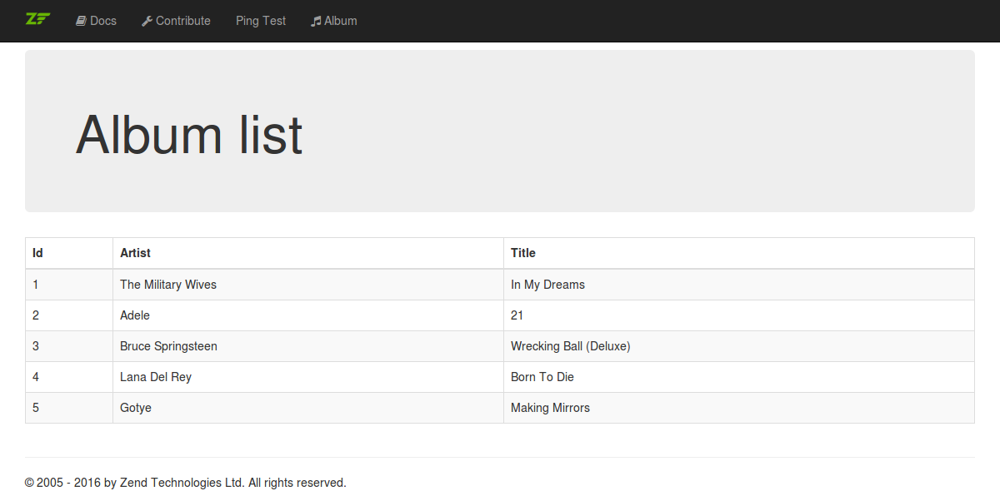

# Part 3: Model and database

In this part of the tutorial we will setup a database and implement the 
model layer for our application. At the end of this part the album list 
page will show the data from the database.

## Setup the database and the database connection

First, we need to setup the database. We will use MySQL for this tutorial,
so please create a new database called `album-tutorial`. Then run these SQL 
statements to create the album table with some test data in it.

```sql
 CREATE TABLE album (
   id int(11) NOT NULL auto_increment,
   artist varchar(100) NOT NULL,
   title varchar(100) NOT NULL,
   PRIMARY KEY (id)
 );
 INSERT INTO album (artist, title)
     VALUES  ('The  Military  Wives',  'In  My  Dreams');
 INSERT INTO album (artist, title)
     VALUES  ('Adele',  '21');
 INSERT INTO album (artist, title)
     VALUES  ('Bruce  Springsteen',  'Wrecking Ball (Deluxe)');
 INSERT INTO album (artist, title)
     VALUES  ('Lana  Del  Rey',  'Born  To  Die');
 INSERT INTO album (artist, title)
     VALUES  ('Gotye',  'Making  Mirrors');
```

Next, you need to update the `composer.json` to require the 
[`Zend\Db`](https://github.com/zendframework/zend-db) component of the 
Zend Framework.
 
```
{
    // ... 

    "require": {
        // ...
         
        "zendframework/zend-expressive-zendviewrenderer": "^1.0",
        "zendframework/zend-db": "^2.5"
    },

    // ... 
}
```

Now you need to do a composer update to install the `Zend\Db`:

```
$ composer update
```

To configure the database access please create the new file 
`/config/autoload/database.global.php` with the following contents:

```php
<?php
return [
    'dependencies' => [
        'factories' => [
            Zend\Db\Adapter\AdapterInterface::class =>
                Zend\Db\Adapter\AdapterServiceFactory::class,
        ],
    ],

    'db' => [
        'driver'  => 'pdo',
        'dsn'     => 'mysql:dbname=album-tutorial;host=localhost;charset=utf8',
        'user'    => 'album',
        'pass'    => 'album',
    ],
];
```

* The `dependencies` configuration section configures the service-manager
  for a new factory. The factory `Zend\Db\Adapter\AdapterServiceFactory` 
  instantiates a new database adapter by using the configuration of the 
  `db` section. The instantiated database adapter will be accessible
  via the name of the `Zend\Db\Adapter\AdapterInterface`.
  
* The `db` configuration section defines the database connection. We will
  use the PDO driver with a MySQL database and the database table and user
  we created above. 

Now the database is setup and we also have setup the database connection
as well.

## Create an album entity

To represent the data of the albums we will create a simple entity class
now. Please create the new path `/src/Album/Model/Entity/` and place a 
`AlbumEntity.php` file in there. 

```php
<?php
namespace Album\Model\Entity;

use Zend\Stdlib\ArraySerializableInterface;

/**
 * Class AlbumEntity
 *
 * @package Album\Model\Entity
 */
class AlbumEntity implements ArraySerializableInterface
{
    /**
     * @var integer
     */
    private $id;

    /**
     * @var string
     */
    private $artist;

    /**
     * @var string
     */
    private $title;

    /**
     * @return int
     */
    public function getId()
    {
        return $this->id;
    }

    /**
     * @return string
     */
    public function getArtist()
    {
        return $this->artist;
    }

    /**
     * @return string
     */
    public function getTitle()
    {
        return $this->title;
    }

    /**
     * @param array $array
     */
    public function exchangeArray(array $array)
    {
        foreach ($array as $key => $value) {
            if (property_exists($this, $key)) {
                $this->$key = $value;
            }
        }
    }

    /**
     * @return array
     */
    public function getArrayCopy()
    {
        $data = [];

        foreach (get_object_vars($this) as $key => $value) {
            $data[$key] = $value;
        }

        return $data;
    }
}
```

There are a couple of things to note:

* The `AlbumEntity` implements the `Zend\Stdlib\ArraySerializableInterface` 
  to provide the methods `exchangeArray()` and `getArrayCopy()` for an easy
  exchange with an array. This will make it easy to bind the entity to a 
  form and to handle the exchange of the data coming from the database.

* The three private properties only allow the access via the implemented
  methods. To get the values for id, artist and title you need to use the
  four getter-methods. To change the data you not to use the 
  exchange-method.

* Within the `exchangeArray()` method the injected array is looped. For 
  each key we check if the property exists. The value is only set for this
  key if that check was successful.
  
* Within the `getArrayCopy()` method we look through all the properties of
  the current object and build a `$data` array that gets returned at the 
  end.

## Create a storage interface

To access the data from the database table we will use the 
`Zend\Db\TableGateway` sub-component. But before we will do that, we need 
another small step.

If we use the `Zend\Db\TableGateway` directly we will bind our model layer
to much to the concrete implementation of the table-gateway. If the 
repository (which we will create in a few steps) will use the table-gateway
we will need to change our repository every time, when the implementation
details of the table-gateway change. To reduce that we will create a 
storage interface which will be used within the repository later on.
 
Please create the new `/src/Album/Model/Storage/` path and place the 
`AlbumStorageInterface.php` file in there. The interface defines methods
for reading a list of albums and a single album and for inserting, 
updating and deleting albums. 

```php
<?php
namespace Album\Model\Storage;

use Album\Model\Entity\AlbumEntity;

/**
 * Interface AlbumStorageInterface
 *
 * @package Album\Model\Storage
 */
interface AlbumStorageInterface
{
    /**
     * Fetch album list
     *
     * @return AlbumEntity[]
     */
    public function fetchAlbumList();

    /**
     * Fetch an album by id
     *
     * @param int $id
     *
     * @return AlbumEntity|null
     */
    public function fetchAlbumById($id);

    /**
     * Insert album
     *
     * @param AlbumEntity $album
     *
     * @return boolean
     */
    public function insertAlbum(AlbumEntity $album);

    /**
     * Update album
     *
     * @param AlbumEntity $album
     *
     * @return boolean
     */
    public function updateAlbum(AlbumEntity $album);

    /**
     * Delete an album
     *
     * @param AlbumEntity $album
     *
     * @return boolean
     */
    public function deleteAlbum(AlbumEntity $album);
}
```

Every data storage you want to create should implement this storage 
interface. Besides a relational database you could build a storage to use a 
web service in the backend, store all date into the file system if needed
or use a Non-SQL database.

## Create a table gateway

A table gateway represents the data of a single table in your database. It
allows the reading and writing access to this data. The 
[`Zend\Db\TableGateway`](http://framework.zend.com/manual/current/en/modules/zend.db.table-gateway.html) 
sub-component implements the 
[table-data-gateway pattern](http://martinfowler.com/eaaCatalog/tableDataGateway.html).
 
Since a storage is not a direct part of the model-layer and can be swapped
we will need to create the new path `/src/Album/Db/` and place the 
`AlbumTableGateway.php` file in there. Our table gateway implements the 
`AlbumStorageInterface` interface and extends the 
`Zend\Db\TableGateway\TableGateway`. 

```php
<?php
namespace Album\Db;

use Album\Model\Entity\AlbumEntity;
use Album\Model\Storage\AlbumStorageInterface;
use Zend\Db\Adapter\AdapterInterface;
use Zend\Db\ResultSet\ResultSetInterface;
use Zend\Db\TableGateway\TableGateway;

/**
 * Class AlbumTableGateway
 *
 * @package Album\Db
 */
class AlbumTableGateway extends TableGateway implements AlbumStorageInterface
{
    /**
     * AlbumTableGateway constructor.
     *
     * @param AdapterInterface   $adapter
     * @param ResultSetInterface $resultSet
     */
    public function __construct(AdapterInterface $adapter, ResultSetInterface $resultSet)
    {
        parent::__construct('album', $adapter, null, $resultSet);
    }

    /**
     * Fetch album list
     *
     * @return AlbumEntity[]
     */
    public function fetchAlbumList()
    {
        $select = $this->getSql()->select();

        $collection = array();

        /** @var AlbumEntity $entity */
        foreach ($this->selectWith($select) as $entity) {
            $collection[$entity->getId()] = $entity;
        }

        return $collection;
    }

    /**
     * Fetch an album by id
     *
     * @param int $id
     *
     * @return AlbumEntity|null
     */
    public function fetchAlbumById($id)
    {
        $select = $this->getSql()->select();
        $select->where->equalTo('id', $id);

        return $this->selectWith($select)->current();
    }

    /**
     * Insert album
     *
     * @param AlbumEntity $album
     *
     * @return boolean
     */
    public function insertAlbum(AlbumEntity $album)
    {
        $insertData = $album->getArrayCopy();

        $insert = $this->getSql()->insert();
        $insert->values($insertData);

        return $this->insertWith($insert) > 0;
    }

    /**
     * Update album
     *
     * @param AlbumEntity $album
     *
     * @return boolean
     */
    public function updateAlbum(AlbumEntity $album)
    {
        $updateData = $album->getArrayCopy();

        $update = $this->getSql()->update();
        $update->set($updateData);
        $update->where->equalTo('id', $album->getId());

        return $this->updateWith($update) > 0;
    }

    /**
     * Delete an album
     *
     * @param AlbumEntity $album
     *
     * @return boolean
     */
    public function deleteAlbum(AlbumEntity $album)
    {
        $delete = $this->getSql()->delete();
        $delete->where->equalTo('id', $album->getId());

        return $this->deleteWith($delete) > 0;
    }
}
```

Please note a couple of things here:

* The constructor has a param for the database adapter and a pre-configured
  result set prototype. This prototype is used for all the selects from the
  database to represent the data. Within the constructor the name of the
  database table is set and the adapter and the prototype are passed to the
  parent constructor.
  
* Within the fetchAlbumList() method a `Select`-object is created based on
  `Zend\Db\Sql`. The data of all albums is fetched from the database and 
  placed in an array collection with the id of the album as the key.

* Within the fetchAlbumById() method a `Select`-object is created as well. 
  The selection is limited to the album with the id that was passed to this
  method. This method just returns the fetched album. 

* Within the insertAlbum() method a `Insert`-object is created which is 
  also based on `Zend\Db\Sql`. The data of the album is extracted and 
  passed to the `Insert`-object. Then the insertion is executed. If a new
  row was created the method returns `true`, otherwise it returns `false`.

* Within the updateAlbum() method a `Update`-object is created which is
  also based on `Zend\Db\Sql`. The data of the album is extracted and 
  passed to the `Update`-object. The updating is limited to the album which 
  was passed to this method. Then the update is executed. If the row was 
  updated the method returns `true`, otherwise it returns `false`.

* Within the deleteAlbum() method a `Delete`-object is created which is
  also based on `Zend\Db\Sql`. The deletion is limited to the album which 
  was passed to this method. Then the deletion is executed. If the row was 
  deleted the method returns `true`, otherwise it returns `false`.

Please note that all of these methods either return an `AlbumEntity` or an 
array collection of `AlbumEntity` instances or accept an 
`AlbumEntity` instance as the only parameter. There is no need of passing 
arrays to the data writing methods or need to handle arrays that are 
passed from to data reading methods.

To get our `AlbumTableGateway` configured properly we will also need a 
factory in the same path. The `AlbumTableGatewayFactory` simply requests
the instance of the database adapter via the DI container 
(the `Zend\ServiceManager` in our case). Then it creates the result set
prototype containing the `Zend\Hydrator\ArraySerializable` and an 
`AlbumEntity` instance. Both the adapter and the prototype are injected 
into the constructor of the `AlbumTableGateway`.

```php
<?php
namespace Album\Db;

use Album\Model\Entity\AlbumEntity;
use Interop\Container\ContainerInterface;
use Zend\Db\Adapter\AdapterInterface;
use Zend\Db\ResultSet\HydratingResultSet;
use Zend\Hydrator\ArraySerializable;

/**
 * Class AlbumTableGatewayFactory
 *
 * @package Album\Db
 */
class AlbumTableGatewayFactory
{
    /**
     * @param ContainerInterface $container
     *
     * @return AlbumTableGateway
     */
    public function __invoke(ContainerInterface $container)
    {
        $adapter = $container->get(AdapterInterface::class);

        $resultSetPrototype = new HydratingResultSet(
            new ArraySerializable(), new AlbumEntity()
        );

        return new AlbumTableGateway($adapter, $resultSetPrototype);
    }
}
```

Please note that [`Zend\Hydrator`](https://github.com/zendframework/zend-hydrator) 
is used to ease the data exchange between the `AlbumEntity` instance and 
the array data that is read from the database. The concrete 
`ArraySerializable` hydrator uses the methods `exchangeArray()` and 
`getArrayCopy()` which are defined in the  
`Zend\Stdlib\ArraySerializableInterface` and implemented in the 
`AlbumEntity` .

## Create an album repository

Next, we will create a repository for the album. The repository will be 
used within our middleware actions and hide the database implementation via
the `AlbumStorageInterface`. This will make it much easier if you need to 
switch from a database to a web service or use a different implementation 
than the table-gateway.

Our repository will be build upon an interface we will look at first. 
Please create the new path `/src/Album/Model/Repository/` and place a 
`AlbumRepositoryInterface.php` file in there. This interface has only 
four methods to fetch a list of albums or a single album and to save or
delete an album entity.

```php
<?php
namespace Album\Model\Repository;

use Album\Model\Entity\AlbumEntity;

/**
 * Interface AlbumRepositoryInterface
 *
 * @package Album\Model\Repository
 */
interface AlbumRepositoryInterface
{
    /**
     * Fetch all albums
     *
     * @return AlbumEntity[]
     */
    public function fetchAllAlbums();

    /**
     * Fetch a single album
     *
     * @param $id
     *
     * @return AlbumEntity|null
     */
    public function fetchSingleAlbum($id);

    /**
     * Save album
     *
     * @param AlbumEntity $album
     *
     * @return boolean
     */
    public function saveAlbum(AlbumEntity $album);

    /**
     * Delete an album
     *
     * @param AlbumEntity $album
     *
     * @return boolean
     */
    public function deleteAlbum(AlbumEntity $album);
}
```

In the same path we will need the `AlbumRepository.php` file now. The class
implements the `AlbumRepositoryInterface` and has one private property for
a storage which can be injected in the constructor.
 
```php
<?php
namespace Album\Model\Repository;

use Album\Model\Entity\AlbumEntity;
use Album\Model\Storage\AlbumStorageInterface;

/**
 * Class ZendDbAlbumRepository
 *
 * @package Album\Model\Repository
 */
class AlbumRepository implements AlbumRepositoryInterface
{
    /**
     * @var AlbumStorageInterface
     */
    private $albumStorage;

    /**
     * AlbumRepository constructor.
     *
     * @param AlbumStorageInterface $albumStorage
     */
    public function __construct(AlbumStorageInterface $albumStorage)
    {
        $this->albumStorage = $albumStorage;
    }

    /**
     * Fetch all albums
     *
     * @return AlbumEntity[]
     */
    public function fetchAllAlbums()
    {
        return $this->albumStorage->fetchAlbumList();
    }

    /**
     * Fetch a single album
     *
     * @param $id
     *
     * @return AlbumEntity|null
     */
    public function fetchSingleAlbum($id)
    {
        return $this->albumStorage->fetchAlbumById($id);
    }

    /**
     * Save album
     *
     * @param AlbumEntity $album
     *
     * @return boolean
     */
    public function saveAlbum(AlbumEntity $album)
    {
        if (!$album->getId()) {
            return $this->albumStorage->insertAlbum($album);
        } else {
            return $this->albumStorage->updateAlbum($album);
        }
    }

    /**
     * Delete an album
     *
     * @param AlbumEntity $album
     *
     * @return boolean
     */
    public function deleteAlbum(AlbumEntity $album)
    {
        return $this->albumStorage->deleteAlbum($album);
    }
}
```

The implemented methods of the repository just need to pass their 
parameters to the appropriate methods of the storage. Only the 
`saveAlbum()` method needs to check the id first to decide if the album 
needs to be inserted or updated.

Now the `AlbumRepository` also needs a factory for proper instantiation. 
The `AlbumRepositoryFactory.php` file should be placed within the same 
file path. In this factory we request the album storage from the DI 
container namely our `Zend\ServiceManager` and pass it to the 
constructor of the repository. That is it.

```php
<?php
namespace Album\Model\Repository;

use Album\Model\Storage\AlbumStorageInterface;
use Interop\Container\ContainerInterface;

/**
 * Class ZendDbAlbumRepositoryFactory
 *
 * @package Album\Model\Repository
 */
class AlbumRepositoryFactory
{
    /**
     * @param ContainerInterface $container
     *
     * @return AlbumRepository
     */
    public function __invoke(ContainerInterface $container)
    {
        $albumStorage = $container->get(AlbumStorageInterface::class);

        return new AlbumRepository($albumStorage);
    }
}
```

## Update the album configuration

Next, we need to update the album configuration. Please open the file 
`/config/autoload/album.global.php` and add the following configuration to
the `dependencies` section.

```php
<?php
return [
    'dependencies' => [
        'factories' => [
            /* ... */

            Album\Model\Repository\AlbumRepositoryInterface::class =>
                Album\Model\Repository\AlbumRepositoryFactory::class,

            Album\Model\Storage\AlbumStorageInterface::class =>
                Album\Db\AlbumTableGatewayFactory::class,
        ],
    ],
    
    /* ... */
];
```

For both the repository and the storage we use the interface names as the
identifier and the factories for the instantiation.

## Update the album list middleware

No it is time to update the album list middleware from the last part. 
Please open the file `/src/Album/Action/AlbumListAction.php` and implement
the following changes.

```php
<?php
namespace Album\Action;

use Album\Model\Repository\AlbumRepositoryInterface;
use Psr\Http\Message\ResponseInterface;
use Psr\Http\Message\ServerRequestInterface;
use Zend\Diactoros\Response\HtmlResponse;
use Zend\Expressive\Template\TemplateRendererInterface;

/**
 * Class AlbumListAction
 *
 * @package Album\Action
 */
class AlbumListAction
{
    /**
     * @var TemplateRendererInterface
     */
    private $template;

    /**
     * @var AlbumRepositoryInterface
     */
    private $albumRepository;

    /**
     * AlbumListAction constructor.
     *
     * @param TemplateRendererInterface $template
     * @param AlbumRepositoryInterface  $albumRepository
     */
    public function __construct(
        TemplateRendererInterface $template,
        AlbumRepositoryInterface $albumRepository
    ) {
        $this->template        = $template;
        $this->albumRepository = $albumRepository;
    }

    /**
     * @param ServerRequestInterface $request
     * @param ResponseInterface      $response
     * @param callable|null          $next
     *
     * @return HtmlResponse
     */
    public function __invoke(
        ServerRequestInterface $request, ResponseInterface $response,
        callable $next = null
    ) {
        $data = [
            'albumList' => $this->albumRepository->fetchAllAlbums(),
        ];

        return new HtmlResponse(
            $this->template->render('album::list', $data)
        );
    }
}
```

* Add another private property `$albumRepository` for the instance of the
  `AlbumRepository`. 
  
* Change the constructor to add a second parameter `$albumRepository` for 
  the instance of the `AlbumRepository` and pass it to the new property.

* Fill the `$data` array within the `invoke()` method with the list of
  albums fetched by the repository.

We also need to update the `AlbumListFactory` factory in the same path. 
Besides the template renderer now the album repository is also read from
the DI container and passed to the constructor.

```php
<?php
namespace Album\Action;

use Album\Model\Repository\AlbumRepositoryInterface;
use Interop\Container\ContainerInterface;
use Zend\Expressive\Template\TemplateRendererInterface;

/**
 * Class AlbumListFactory
 *
 * @package Album\Action
 */
class AlbumListFactory
{
    /**
     * @param ContainerInterface $container
     *
     * @return AlbumListAction
     */
    public function __invoke(ContainerInterface $container)
    {
        $template        = $container->get(TemplateRendererInterface::class);
        $albumRepository = $container->get(AlbumRepositoryInterface::class);

        return new AlbumListAction($template, $albumRepository);
    }
}
```

## Update the album list template

Finally, you can update the album list template now to output the list of
albums. The list is presented within a table styled by Bootstrap. We loop
through all the albums and echo the id, artist and title by accessing the
getter-methods of the `AlbumEntity`. 

```php
<?php
use Album\Model\Entity\AlbumEntity;

$this->headTitle('Albums');
?>

<div class="jumbotron">
    <h1>Album list</h1>
</div>

<table class="table table-bordered table-striped">
    <thead>
    <tr>
        <th>Id</th>
        <th>Artist</th>
        <th>Title</th>
    </tr>
    </thead>
    <tbody>
    <?php /** @var AlbumEntity $albumEntity */ ?>
    <?php foreach ($this->albumList as $albumEntity) : ?>
        <tr>
            <td><?php echo $albumEntity->getId(); ?></td>
            <td><?php echo $albumEntity->getArtist(); ?></td>
            <td><?php echo $albumEntity->getTitle(); ?></td>
        </tr>
    <?php endforeach; ?>
    </tbody>
</table>
```

Now you can browse to 
[http://localhost:8080/album](http://localhost:8080/album) to see if the 
album list is shown as expected. 



## Update tests for album list middleware

Finally, you need to update the tests in the `/test/AlbumTest/Action/` 
path. The `AlbumListActionTest` has to test the injection of the 
`AlbumRepository` instance and the call to its `fetchAllAlbums()` method.

```php
<?php
namespace AppTest\Action;

/* ... */

class AlbumListActionTest extends PHPUnit_Framework_TestCase
{
    /* ... */

    /**
     * Test if action renders the album list
     */
    public function testActionRendersAlbumList()
    {
        $albumRepository = $this->prophesize(
            AlbumRepositoryInterface::class
        );
        $albumRepository->fetchAllAlbums()->shouldBeCalled()->willReturn(
            ['album1', 'album2']
        );

        $renderer = $this->prophesize(TemplateRendererInterface::class);
        $renderer->render(
            'album::list', ['albumList' => ['album1', 'album2']]
        )->shouldBeCalled()->willReturn('BODY');

        $action = new AlbumListAction(
            $renderer->reveal(), $albumRepository->reveal()
        );

        $response = $action(
            $this->request->reveal(),
            $this->response->reveal(),
            $this->next
        );

        $this->assertInstanceOf(HtmlResponse::class, $response);

        $this->assertEquals('BODY', $response->getBody());
    }
}
```

And the factory test case also needs to test the injection of the 
`AlbumRepository` as well.

```php
<?php
namespace AppTest\Action;

/* ... */

class AlbumListFactoryTest extends \PHPUnit_Framework_TestCase
{
    /* ... */

    /**
     * Test if factory returns the correct action
     */
    public function testFactory()
    {
        $factory = new AlbumListFactory();

        $this->container
            ->get(TemplateRendererInterface::class)
            ->willReturn(
                $this->prophesize(TemplateRendererInterface::class)
            );

        $this->container
            ->get(AlbumRepositoryInterface::class)
            ->willReturn(
                $this->prophesize(AlbumRepositoryInterface::class)
            );

        $action = $factory($this->container->reveal());

        $this->assertTrue($action instanceof AlbumListAction);
    }
}
```

To run the tests simple run this command:

```
$ phpunit
```

## Compare with example repository branch `part3`

You can easily compare your code with the example repository when looking 
at the branch `part3`. If you want you can even clone it and have a deeper
look.

[https://github.com/RalfEggert/zend-expressive-tutorial/tree/part3](https://github.com/RalfEggert/zend-expressive-tutorial/tree/part3)
