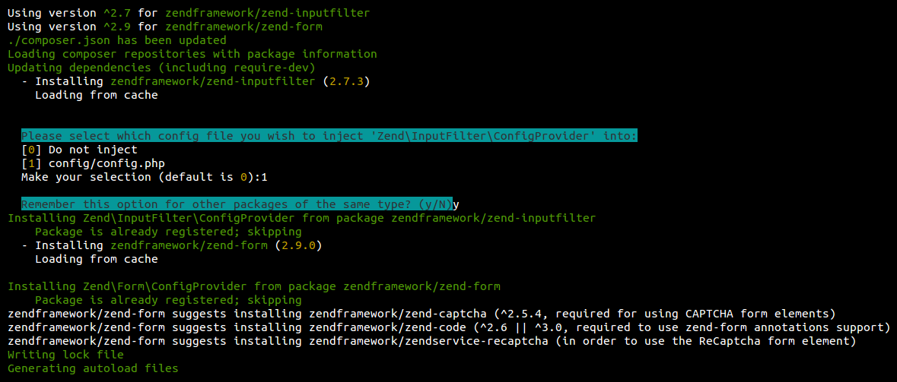
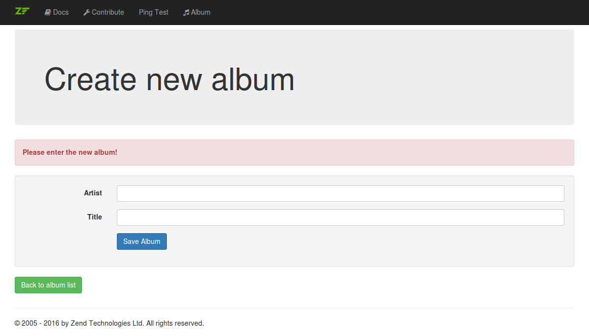

# Part 4: Forms and input filter

In this part of the tutorial we will create an input filter and a form
to allow the user of the album application to add new albums. We will also
need to create some new middleware actions for the form display and 
handling. 

## Add more Zend Framework components

To make sure that the needed Zend Framework components are installed, you 
need to run the Composer to require the 
[`Zend\Form`](https://github.com/zendframework/zend-form) and the 
[`Zend\InputFilter`](https://github.com/zendframework/zend-inputfilter) 
components of the Zend Framework.
 
```
$ composer require zendframework/zend-inputfilter zendframework/zend-form
```

Please note: since `Zend\Form` currently requires `Zend\InputFilter` we
do not really need to add both. `Zend\Form` would be enough.
 
When you run this installation via Composer the `Zend\ComponentInstaller`
steps in here now and asks you if you want to inject the 
`Zend\InputFilter\ConfigProvider` into your config file. You should select 
it with the choice of `1` and also remember your decision with `y`. It 
should look like this:



Please note that your `/config/config.php` should be updated as well by 
adding the `Zend\InputFilter\ConfigProvider` and 
`Zend\Form\ConfigProvider`:

```php

use Zend\Expressive\ConfigManager\ConfigManager;
use Zend\Expressive\ConfigManager\PhpFileProvider;

$configManager = new ConfigManager([
    \Zend\Form\ConfigProvider::class,
    \Zend\InputFilter\ConfigProvider::class,
    \Zend\Hydrator\ConfigProvider::class,
    \Zend\Db\ConfigProvider::class,
    Zend\Filter\ConfigProvider::class,
    Zend\I18n\ConfigProvider::class,
    Zend\Router\ConfigProvider::class,
    Zend\Validator\ConfigProvider::class,
    new PhpFileProvider('config/autoload/{{,*.}global,{,*.}local}.php'),
]);

return new ArrayObject($configManager->getMergedConfig());
```

## Create the album input filter

First, we need to create the album input filter. The `Zend\InputFilter` 
component can be used to filter and validate generic sets of input data.
This input filter can work together with the form we will create in the 
next step.
 
Please create a new path `/src/Album/Model/InputFilter/` and place the new
`AlbumInputFilter.php` file in there. The `AlbumInputFilter` defines two input 
elements, one for the artist and one for the title. Both input elements are
mandatory and get a set of filters and validators defined. The id does not
need an input element.

```php
<?php
namespace Album\Model\InputFilter;

use Zend\InputFilter\InputFilter;

/**
 * Class AlbumInputFilter
 *
 * @package Album\Model\InputFilter
 */
class AlbumInputFilter extends InputFilter
{
    /**
     * Init input filter
     */
    public function init()
    {
        $this->add([
            'name'     => 'artist',
            'required' => true,
            'filters'  => [
                ['name' => 'StripTags'],
                ['name' => 'StringTrim'],
            ],
            'validators' => [
                [
                    'name'    => 'StringLength',
                    'options' => [
                        'min'      => 1,
                        'max'      => 100,
                    ],
                ],
            ],
        ]);

        $this->add([
            'name'     => 'title',
            'required' => true,
            'filters'  => [
                ['name' => 'StripTags'],
                ['name' => 'StringTrim'],
            ],
            'validators' => [
                [
                    'name'    => 'StringLength',
                    'options' => [
                        'min'      => 1,
                        'max'      => 100,
                    ],
                ],
            ],
        ]);
    }
}
```

Please note that the adding of the input elements is done in the 
`init()` method. This method is automatically called when the input filter
is instantiated through the input filter manager. The input filter manager
is a specialized service-manager just for input filter classes. We won't 
use the input filter manager in this tutorial. By implementing the `init()` 
method it will be much easier to setup the input filter manager in your
project at a later time.

Please also note that we have filtering and validation now within the
private setter-methods of the `AlbumEntity` and the `AlbumInputFilter`. 
This might look redundant, but there are good reasons for this. 

* The `AlbumEntity` always makes sure that no invalid data is passed by 
  throwing the exceptions. You cannot set a title with more than 100 chars.
  
* The `AlbumInputFilter` also makes sure that no invalid data is passed by
  a form. While the exceptions within the `AlbumEntity` will be thrown one 
  by one, the `AlbumInputFilter` always checks all input data and generates
  the error messages.
  
* This two-level filtering and validation is a common practice. You could
  compare it with JavaScript validation in the front end and PHP validation
  in the backend.

Of course the `AlbumInputFilter` will need a factory as will. So please 
create another `AlbumInputFilterFactory.php` file in the same path. The 
factory is just instantiating the `AlbumInputFilter` and running the
`init()` method. If you need to add further configuration like some valid 
options for another input element you can inject that after instantiation
and before the call of the `init()` method.

```php
<?php
namespace Album\Model\InputFilter;

use Interop\Container\ContainerInterface;

/**
 * Class AlbumInputFilterFactory
 *
 * @package Album\Model\InputFilter
 */
class AlbumInputFilterFactory
{
    /**
     * @param ContainerInterface $container
     *
     * @return AlbumInputFilter
     */
    public function __invoke(ContainerInterface $container)
    {
        $inputFilter = new AlbumInputFilter();
        $inputFilter->init();

        return $inputFilter;
    }
}
```

## Create the album form

Next we will need to create a form for the album data. The `Zend\Form` 
component can be used to structure and display forms. It can work
together with the album input filter we just created.

Please create another new path `/src/Album/Form/` and place a new file 
`AlbumDataForm.php` in there. The `AlbumDataForm` extends the class 
`Zend\Form\Form` and defines two form elements (one for the artist and one 
for the title) and a submit button. The form elements are setup as text 
inputs and named by a label. All elements get some CSS classes defined to 
be used by Bootstrap again.

```php
<?php
namespace Album\Form;

use Zend\Form\Form;

/**
 * Class AlbumDataForm
 *
 * @package Album\Form
 */
class AlbumDataForm extends Form
{
    /**
     * Init form
     */
    public function init()
    {
        $this->setName('album_form');
        $this->setAttribute('class', 'form-horizontal');

        $this->add(
            [
                'name'       => 'artist',
                'type'       => 'Text',
                'attributes' => [
                    'class' => 'form-control',
                ],
                'options'    => [
                    'label'            => 'Artist',
                    'label_attributes' => [
                        'class' => 'col-sm-2 control-label',
                    ],
                ],
            ]
        );

        $this->add(
            [
                'name'       => 'title',
                'type'       => 'Text',
                'attributes' => [
                    'class' => 'form-control',
                ],
                'options'    => [
                    'label' => 'Title',
                    'label_attributes' => [
                        'class' => 'col-sm-2 control-label',
                    ],
                ],
            ]
        );

        $this->add(
            [
                'name'       => 'save_album',
                'type'       => 'Submit',
                'attributes' => [
                    'class' => 'btn btn-primary',
                    'value' => 'Save Album',
                    'id'    => 'save_album',
                ],
            ]
        );
    }
}
```

Please note that the adding of the form elements is also done in the 
`init()` method. This method is automatically called when the form is 
instantiated through the form element manager. The form element manager
is a specialized service-manager just for form elements and forms. We won't 
use the form element manager in this tutorial. By implementing the `init()` 
method it will be much easier to setup the form element manager in your
project at a later time.

The `AlbumDataForm` also needs a factory which is created in the 
`AlbumDataFormFactory.php` file in the same path. This factory instantiates
the `AlbumDataForm` form and injects an instance of the 
`Zend\Hydrator\ArraySerializable` and the album input filter we just 
created.

```php
<?php
namespace Album\Form;

use Album\Model\InputFilter\AlbumInputFilter;
use Interop\Container\ContainerInterface;
use Zend\Form\Form;
use Zend\Hydrator\ArraySerializable;

/**
 * Class AlbumDataFormFactory
 *
 * @package Album\Form
 */
class AlbumDataFormFactory extends Form
{
    /**
     * @param ContainerInterface $container
     *
     * @return AlbumDataForm
     */
    public function __invoke(ContainerInterface $container)
    {
        $hydrator    = new ArraySerializable();
        $inputFilter = $container->get(AlbumInputFilter::class);

        $form = new AlbumDataForm();
        $form->setHydrator($hydrator);
        $form->setInputFilter($inputFilter);
        $form->init();

        return $form;
    }
}
```

Please note that the injection of the `Zend\Hydrator\ArraySerializable` is
done for a special reason. We can now bind an `AlbumEntity` instance to 
the form and the hydrator helps to extract the data from the entity and 
fill the form elements with these values. We could also pass array data to 
the form and get the `AlbumEntity` populated with this data after a 
successful form validation.

## Update album configuration

Next, we need to update the album configuration in the 
`/config/autload/album.global.php` file. 

```php
<?php
return [
    'dependencies' => [
        'factories' => [
            /* ... */
            
            Album\Action\AlbumCreateFormAction::class   =>
                Album\Action\AlbumCreateFormFactory::class,
            Album\Action\AlbumCreateHandleAction::class =>
                Album\Action\AlbumCreateHandleFactory::class,

            Album\Form\AlbumDataForm::class =>
                Album\Form\AlbumDataFormFactory::class,

            Album\Model\InputFilter\AlbumInputFilter::class =>
                Album\Model\InputFilter\AlbumInputFilterFactory::class,

            /* ... */
        ],
    ],

    'routes' => [
        /* ... */
        
        [
            'name'            => 'album-create',
            'path'            => '/album/create',
            'middleware'      => Album\Action\AlbumCreateFormAction::class,
            'allowed_methods' => ['GET'],
        ],
        [
            'name'            => 'album-create-handle',
            'path'            => '/album/create/handle',
            'middleware'      => [
                Album\Action\AlbumCreateHandleAction::class,
                Album\Action\AlbumCreateFormAction::class,
            ],
            'allowed_methods' => ['POST'],
        ],
    ],

    /* ... */
];
```

* We have added the DI container configuration for both the album form and
  the album input filter in the `dependencies` section.
  
* In the `routes` section two new routes were added. 

  * The first route is called `album-create` and should process the 
    `Album\Action\AlbumCreateFormAction` for GET requests. 
  * The second route is called `album-create-handle` and should process the 
    `Album\Action\AlbumCreateHandleAction` for POST requests. It also adds
    the `Album\Action\AlbumCreateFormAction` to the pipeline as the next
    middleware.
    
* These two new middleware actions were also added to the `dependencies` 
  section to inform the DI container of its existence. Both need a factory
  to get instantiated.

## Create album form create action

Please create the `AlbumCreateFormAction.php` file in the existing 
`/src/Album/Action/` path. The `AlbumCreateFormAction` is used to show the 
album form for creating new albums. It won't handle the form processing, 
it only passes the form to the template for rendering. And it sets a 
message depending on the current form validation state. 

```php
<?php
namespace Album\Action;

use Album\Form\AlbumDataForm;
use Psr\Http\Message\ResponseInterface;
use Psr\Http\Message\ServerRequestInterface;
use Zend\Diactoros\Response\HtmlResponse;
use Zend\Expressive\Template\TemplateRendererInterface;

/**
 * Class AlbumCreateFormAction
 *
 * @package Album\Action
 */
class AlbumCreateFormAction
{
    /**
     * @var TemplateRendererInterface
     */
    private $template;

    /**
     * @var AlbumDataForm
     */
    private $albumForm;

    /**
     * AlbumCreateFormAction constructor.
     *
     * @param TemplateRendererInterface $template
     * @param AlbumDataForm             $albumForm
     */
    public function __construct(
        TemplateRendererInterface $template,
        AlbumDataForm $albumForm
    ) {
        $this->template  = $template;
        $this->albumForm = $albumForm;
    }

    /**
     * @param ServerRequestInterface $request
     * @param ResponseInterface      $response
     * @param callable|null          $next
     *
     * @return HtmlResponse
     */
    public function __invoke(
        ServerRequestInterface $request, ResponseInterface $response,
        callable $next = null
    ) {
        if ($this->albumForm->getMessages()) {
            $message = 'Please check your input!';
        } else {
            $message = 'Please enter the new album!';
        }

        $data = [
            'albumForm' => $this->albumForm,
            'message'   => $message,
        ];

        return new HtmlResponse(
            $this->template->render('album::create', $data)
        );
    }
}
```

* The `AlbumCreateFormAction` has two dependencies. It needs the template
  renderer and an instance of the `AlbumDataForm` which can both be 
  injected to the constructor during instantiation.
   
* Within the `__invoke()` method it first checks if the form was validated
  with errors to set a different message. This is needed because the 
  `AlbumCreateFormAction` middleware will also be processed after the
  `Album\Action\AlbumCreateHandleAction` when the form validation failed 
  (see the configuration for the route `album-create-handle` above).

* After setting a message both the form and the message are passed to the
  template renderer which renders the `album::create` template and passes
  the generated HTML to the `HtmlResponse`.
  
Now the `AlbumCreateFormAction` needs a factory to inject both the 
template renderer and the form instance. Please create the 
`AlbumCreateFormFactory.php` file to do the job. Both dependencies are
requested from the DI container.

```php
<?php
namespace Album\Action;

use Album\Form\AlbumDataForm;
use Interop\Container\ContainerInterface;
use Zend\Expressive\Template\TemplateRendererInterface;

/**
 * Class AlbumCreateFormFactory
 *
 * @package Album\Action
 */
class AlbumCreateFormFactory
{
    /**
     * @param ContainerInterface $container
     *
     * @return AlbumCreateFormAction
     */
    public function __invoke(ContainerInterface $container)
    {
        $template  = $container->get(TemplateRendererInterface::class);
        $albumForm = $container->get(AlbumDataForm::class);

        return new AlbumCreateFormAction(
            $template, $albumForm
        );
    }
}
```

## Create album form handling action

Now create the `AlbumCreateHandleAction.php` file within the same path.
This middleware action is used for the form handling of the album form. 
It can only be accessed when a POST request is send to the path of the
`album-create-handle` route (see the configuration for the route above).

```php
<?php
namespace Album\Action;

use Album\Form\AlbumDataForm;
use Album\Model\Entity\AlbumEntity;
use Album\Model\Repository\AlbumRepositoryInterface;
use Psr\Http\Message\ResponseInterface;
use Psr\Http\Message\ServerRequestInterface;
use Zend\Diactoros\Response\HtmlResponse;
use Zend\Diactoros\Response\RedirectResponse;
use Zend\Expressive\Router\RouterInterface;

/**
 * Class AlbumCreateHandleAction
 *
 * @package Album\Action
 */
class AlbumCreateHandleAction
{
    /**
     * @var RouterInterface
     */
    private $router;

    /**
     * @var AlbumRepositoryInterface
     */
    private $albumRepository;

    /**
     * @var AlbumDataForm
     */
    private $albumForm;

    /**
     * AlbumCreateHandleAction constructor.
     *
     * @param RouterInterface          $router
     * @param AlbumRepositoryInterface $albumRepository
     * @param AlbumDataForm            $albumForm
     */
    public function __construct(
        RouterInterface $router,
        AlbumRepositoryInterface $albumRepository,
        AlbumDataForm $albumForm
    ) {
        $this->router          = $router;
        $this->albumRepository = $albumRepository;
        $this->albumForm       = $albumForm;
    }

    /**
     * @param ServerRequestInterface $request
     * @param ResponseInterface      $response
     * @param callable|null          $next
     *
     * @return HtmlResponse
     */
    public function __invoke(
        ServerRequestInterface $request, ResponseInterface $response,
        callable $next = null
    ) {
        $postData = $request->getParsedBody();

        $this->albumForm->setData($postData);

        if ($this->albumForm->isValid()) {
            $album = new AlbumEntity();
            $album->exchangeArray($postData);

            if ($this->albumRepository->saveAlbum($album)) {
                return new RedirectResponse(
                    $this->router->generateUri('album')
                );
            }
        }

        return $next($request, $response);
    }
}
```

* The class `AlbumCreateHandleAction` has three dependencies:

  * It needs the instance of the router to generate an URL for a route to
    redirect to. 
  * It needs the instance of the album repository to be able to save the
    new album.
  * It needs the instance of the album data form for the form handling
    and validation.

* All dependencies can be injected via the constructor.

* In the `__invoke()` method the form handling is processed.

  * First the post data is accessed from the request.
  * Then the post data is passed to the form.
  * Then the form validation is started.
  * If the form validation was successful... 
    * A new `AlbumEntity` is created
    * The data is passed to its `exchangeArray()` method. 
    * This new entity is saved with the repository.
    * A `RedirectResponse` is created to redirect to the album list.
  
  * If the form validation failed...
    * The next middleware is processed. From the route configuration you
      know that the `AlbumCreateFormAction` is the next middleware. This
      will show the create form now but with all the validation error 
      messages.

Of course, the `AlbumCreateHandleAction` also needs a factory. Please 
place it within the same path. The factory requests the three dependencies
from the DI container and passes them to the constructor of the class.

```php
<?php
namespace Album\Action;

use Album\Form\AlbumDataForm;
use Album\Model\Repository\AlbumRepositoryInterface;
use Interop\Container\ContainerInterface;
use Zend\Expressive\Router\RouterInterface;
use Zend\Expressive\Template\TemplateRendererInterface;

/**
 * Class AlbumCreateHandleFactory
 *
 * @package Album\Action
 */
class AlbumCreateHandleFactory
{
    /**
     * @param ContainerInterface $container
     *
     * @return AlbumCreateHandleAction
     */
    public function __invoke(ContainerInterface $container)
    {
        $router          = $container->get(RouterInterface::class);
        $albumRepository = $container->get(AlbumRepositoryInterface::class);
        $albumForm       = $container->get(AlbumDataForm::class);

        return new AlbumCreateHandleAction(
            $router, $albumRepository, $albumForm
        );
    }
}
```

## Create album creation template

Next, you need to create the `create.phtml` file in the existing 
`/templates/album/` path. This template should render the album data form.

```php
<?php
use Album\Form\AlbumDataForm;

/** @var AlbumDataForm $form */
$form = $this->albumForm;
$form->setAttribute('action', $this->url('album-create-handle'));

$this->headTitle('Create new album');
?>

<div class="jumbotron">
    <h1>Create new album</h1>
</div>

<div class="alert alert-danger">
    <strong><?php echo $this->message; ?></strong>
</div>

<div class="well">
    <?php echo $this->form()->openTag($form); ?>
    <div class="form-group">
        <?php echo $this->formLabel($form->get('artist')); ?>
        <div class="col-sm-10">
            <?php echo $this->formElement($form->get('artist')); ?>
            <?php echo $this->formElementErrors($form->get('artist')); ?>
        </div>
    </div>
    <div class="form-group">
        <?php echo $this->formLabel($form->get('title')); ?>
        <div class="col-sm-10">
            <?php echo $this->formElement($form->get('title')); ?>
            <?php echo $this->formElementErrors($form->get('title')); ?>
        </div>
    </div>
    <div class="form-group">
        <div class="col-sm-offset-2 col-sm-10">
            <?php echo $this->formElement($form->get('save_album')); ?>
        </div>
    </div>
    <?php echo $this->form()->closeTag(); ?>
</div>

<p>
    <a href="<?php echo $this->url('album') ?>" class="btn btn-success">
        Back to album list
    </a>
</p>
```

* It sets the form action to the url for the `album-create-handle` route 
  which is generated with the `url` view helper. 
  
* It displays the heading and the current message. 

* It renders the form by using the `form`, the `formLabel`, the 
  `formElement` and the `formElementErrors` view helpers for the two form 
  elements and the submit button.
  
* At the bottom it displays a link back to the album list.

## Add link to the album list page

Finally, you only need to add a link button to the album list page. Please open
the `list.phtml` file in the `/templates/album/` path. Add the link at the
bottom of the page by using the `url` view helper with the `album-create` 
route. 

```php
<p>
    <a href="<?php echo $this->url('album-create') ?>" class="btn btn-success">
        Create new album
    </a>
</p>
```

Now you can browse to 
[http://localhost:8080/album/create](http://localhost:8080/album/create) 
to see if the album form is shown as expected. Please try to enter a new 
album with no data and with valid data and see what happens. If the 
creation of a new album is successful it will be displayed in the album 
list.



## Compare with example repository branch `part4`

You can easily compare your code with the example repository when looking 
at the branch `part4`. If you want you can even clone it and have a deeper
look.

[https://github.com/RalfEggert/zend-expressive-tutorial/tree/part4](https://github.com/RalfEggert/zend-expressive-tutorial/tree/part4)
